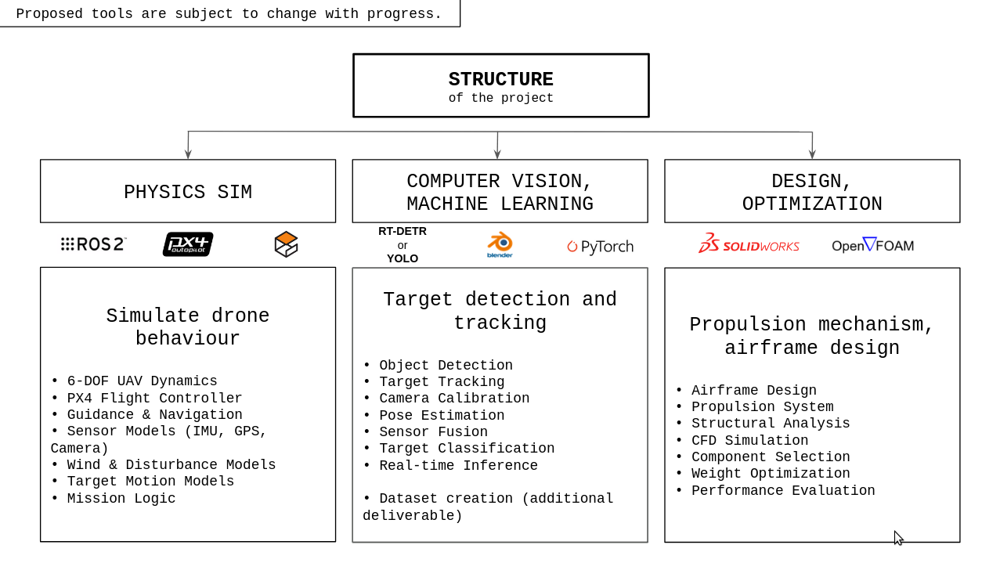
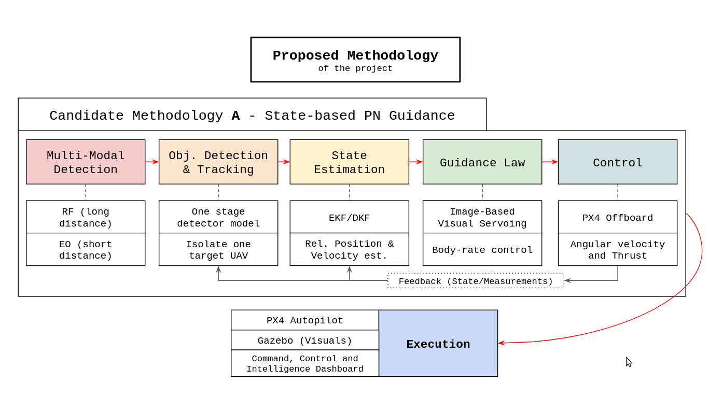

# Autonomous-Interceptor-Sim

A simulation and robotics project focused on the development of an autonomous UAV interceptor capable of detecting, tracking, guiding toward, and intercepting a moving aerial target.
The project combines mathematical modeling, guidance algorithms, autonomous control, ROS 2, PX4, and Gazebo to develop and validate an end-to-end interceptor simulation framework.

For the current progress reagrding guidance algorithm, check https://github.com/BoldRhythm/Simplified-UAV-Navigation-and-Guidance-Sim






# Current Progress: 

Initial testing work with proportional navigation was done in Python. Kindly check [Standalone UAV Navigation and Guidance Simulator](https://github.com/BoldRhythm/Simplified-UAV-Navigation-and-Guidance-Sim)
The work since has moved completely over to ROS2, and Gazebo, with PX4 handling the drone state.

So far, the ROS2 node for velocity control, ros_gz_bridge for the image topic to handle camera feed - viewed using a ROS2 node (openCV) and multi-drone capability without RAM leaks in ruby are up. Also, a singular bash file can also be used to launch PX4 and gazebo for simulation, along with htop for resource monitoring. Needs PX4 to be installed in ~/PX4-Autopilot (i.e. the default directory structure), and bash as the shell.

For the Image-Based Visual Servoing, the angular velocity commands work to handle the yaw through the body-rate controller topic perfectly, easy to tune through a singular parameter kb in the Lyapunov candidate function. For the target being at a different altitude, thrust control is being implemented (so far, the state-transistion matrix F has been implemented. Check node Attitude_working in the ros2 workspace). The guidance law is achieving an intercept under specific ideal assumptions and conditions. 

## Installation

### Prerequisites

The project currently requires:

* Ubuntu Linux - 22.04
* ROS 2 Jazzy
* Gazebo Harmonic
* PX4 Autopilot
* Tmux
* Python 3
* Git

The project is currently being developed on :
* GPU : RTX 3060Ti
* Processor : Ryzen 7 3700x
* RAM : 16GB DDR4
> **Note:** Though these are the specs, it can run on slower computers as well. Will update the minimum requirements as we figure them out.


### Clone the Repository

Clone the repository using SSH:

```bash
git clone git@github.com:BoldRhythm/Autonomous-Interceptor-Sim.git
cd Autonomous-Interceptor-Sim
```

Or using https:
```bash
git clone https://github.com/BoldRhythm/Autonomous-Interceptor-Sim.git
cd Autonomous-Interceptor-Sim
```

## Shell-scripts

This directory has two bash scripts, which can be used to launch tmux with a designated pane layout, containting - microXRCE DDS agent, htop, two gazebo+px4 windows for two custom quadcopters (kindly modify to launch any prepared quadcopter you have (e.g. 4001 x_500, this one contains our custom one, not included yet due to lack of refinement.)

### ROS 2 Workspace

Navigate to the ROS 2 workspace:

```bash
cd ros2_px4_ws
```

Install any required dependencies:

```bash
rosdep install --from-paths src --ignore-src -r -y
```

Build the workspace:

```bash
colcon build
```

Source the workspace:

```bash
source install/setup.bash
```

For convenience, the workspace can be sourced automatically in future terminal sessions:

```bash
echo "source ~/Projects/interceptor-sim/ros2_px4_ws/install/setup.bash" >> ~/.bashrc
source ~/.bashrc
```

> **Note:** The exact PX4, Gazebo and Tmux installation procedure is maintained separately because these are external dependencies of the project. Do check out their official documentation for installation procedure.
